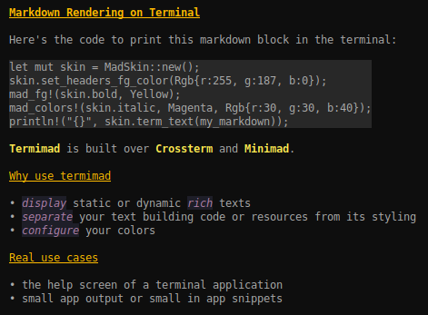
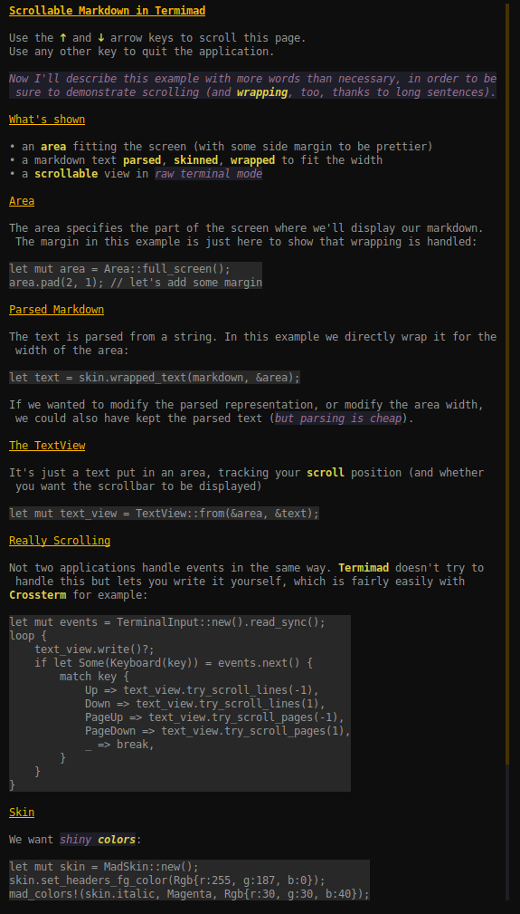

[![MIT][s2]][l2] [![Latest Version][s1]][l1] [![docs][s3]][l3] [![Chat on Miaou][s4]][l4]

[s1]: https://img.shields.io/crates/v/termimad.svg
[l1]: https://crates.io/crates/termimad

[s2]: https://img.shields.io/badge/license-MIT-blue.svg
[l2]: termimad/LICENSE

[s3]: https://docs.rs/termimad/badge.svg
[l3]: https://docs.rs/termimad/

[s4]: https://miaou.dystroy.org/static/shields/room.svg
[l4]: https://miaou.dystroy.org/3


A simple tool to display static or dynamic Markdown snippets in the terminal, with skin isolation.

Based on crossterm so works on most terminals (even on windows).



Note that the goal isn't to display any markdown text with its various extensions (a terminal isn't really fit for that). The goal is rather to improve the display of texts in a terminal application when we want both the text and the skin to be easily configured.

##  Usage

```toml
[dependencies]
termimad = "0.2"
```

### With the default skin:

```rust
termimad::print_inline("**some** *nested **style*** and `some(code)`");
```
or
```rust
print!("{}", termimad.inline("**some** *nested **style*** and `some(code)`"));
```

Result:


### With a custom skin:

```rust
let mut skin = MadSkin::new();
skin.bold = skin.bold.fg(Yellow);
skin.print_line_ln("*Hey* **World!** Here's `some(code)`");
mad_colors!(skin.normal, Magenta, Rgb{r:30, g:30, b:40});
skin.italic.add_attr(Underlined);
println!("and now {}", skin.line("a little *too much* **style!** (and `some(code)` too)"));
```

Result:


### Scrollable TextView in a raw terminal:



The code for this example is in examples/scrollable. To read the whole text just do

    cargo run --example scrollable

