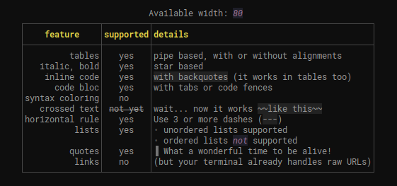
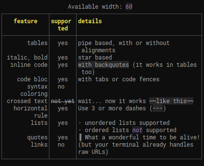
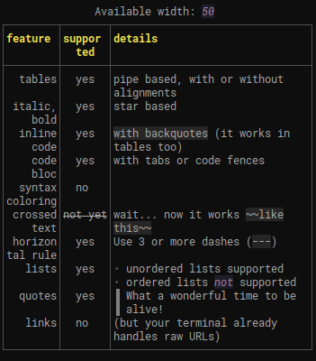

[![MIT][s2]][l2] [![Latest Version][s1]][l1] [![docs][s3]][l3] [![Chat on Miaou][s4]][l4]

[s1]: https://img.shields.io/crates/v/termimad.svg
[l1]: https://crates.io/crates/termimad

[s2]: https://img.shields.io/badge/license-MIT-blue.svg
[l2]: LICENSE

[s3]: https://docs.rs/termimad/badge.svg
[l3]: https://docs.rs/termimad/

[s4]: https://miaou.dystroy.org/static/shields/room.svg
[l4]: https://miaou.dystroy.org/3


A simple tool to display static or dynamic Markdown snippets in the terminal, with skin isolation.

Based on [crossterm](https://github.com/TimonPost/crossterm) so works on most terminals (even on windows).


The goal isn't to display any markdown text with its various extensions (a terminal isn't really fit for that). The goal is rather to improve the display of texts in a terminal application when we want both the text and the skin to be easily configured.

Termimad also includes a few utilities helping efficient managing of events and user input in a multithread application.

**Wrapping**, table balancing, and **scrolling** are essential features of Termimad.

A text or a table can be displayed in an *a priori* unknown part of the screen, scrollable if desired, with a dynamically discovered width.

For example this markdown:

	|:-:|:-:|-
	|**feature**|**supported**|**details**|
	|-:|:-:|-
	| tables | yes | pipe based, with or without alignments
	| italic, bold | yes | star based |
	| inline code | yes | `with backquotes` (it works in tables too)
	| code bloc | yes |with tabs; fences *not* supported
	| syntax coloring | no |
	| crossed text |  ~~not yet~~ | wait... now it works `~~like this~~`
	| horizontal rule | yes | Use 3 or more dashes (`---`)
	| lists | yes|* unordered lists supported
	|  | |* ordered lists *not* supported
	| quotes |  yes |> What a wonderful time to be alive!
	| links | no | (but your terminal already handles raw URLs)
	|-

will give different results depending on the width:







##  Usage

```toml
[dependencies]
termimad = "0.5"
```

### With the default skin:

```rust
termimad::print_inline("**some** *nested **style*** and `some(code)`");
```
or
```rust
print!("{}", termimad::inline("**some** *nested **style*** and `some(code)`"));
```

Result:


### Inline snippets with a custom skin:

*Inline snippets* are one line or less.

```rust
let mut skin = MadSkin::default();
skin.bold.set_fg(Yellow);
skin.print_inline("*Hey* **World!** Here's `some(code)`");
skin.paragraph.set_fgbg(Magenta, rgb(30, 30, 40));
skin.italic.add_attr(Underlined);
println!("\nand now {}\n", skin.inline("a little *too much* **style!** (and `some(code)` too)"));
```

Result:


#### Texts

*Texts* can be several lines. Tables and code blocks are automatically aligned, justified and consistently wrapped.

```rust
skin.print_text("# title\n* a list item\n* another item");
```

### Scrollable TextView in a raw terminal:


The code for this example is in examples/scrollable. To read the whole text just do

    cargo run --example scrollable

### Templates

In order to separate the rendering format from the content, the `format!` macro is not always a good solution because you may not be sure the content is free of characters which may mess the markdown.

A solution is to use one of the templating functions or macros.

Example:

```
mad_print_inline!(
	&skin,
	"**$0 formula:** *$1*", // the markdown template, interpreted once
	"Disk",  // fills $0
	"2*π*r", // fills $1. Note that the stars don't mess the markdown
);
```


Main difference with using `print!(format!( ... ))`:
* the markdown parsing and template building are done only once (using `lazy_static` internally)
* the given values aren't interpreted as markdown fragments and don't impact the style
* arguments can be omited, repeated, given in any order
* no support for fmt parameters or arguments other than `&str` *(in the current version)*

You'll find more examples and advice in the *templates* example.

Note that there's no macro yet supporting templates for whole markdown *texts* but they should be available soon.

## Advices to get started

* Start by reading the examples (in `/examples`): they cover almost the whole API, including templates, how to use an alternate screen or scroll the page, etc.
* If you want to see how some file would look with Termimad, you may try the cli [Clima](https://github.com/Canop/clima).
* Be careful that some colors aren't displayable on all terminals. The default color set of your application should not include arbitrary RGB colors.
* If a feature is missing, or you don't know how to use some part, come and ping me on my chat during West European hours.

[broot](https://github.com/Canop/broot) is a real application using Termimad, you might want to see how it does it.

[whalespotter](https://github.com/Canop/whalespotter) has been designed specifically to showcase Termimad components in a real application.

If you're the author of another application using Termimad, please tell me.
