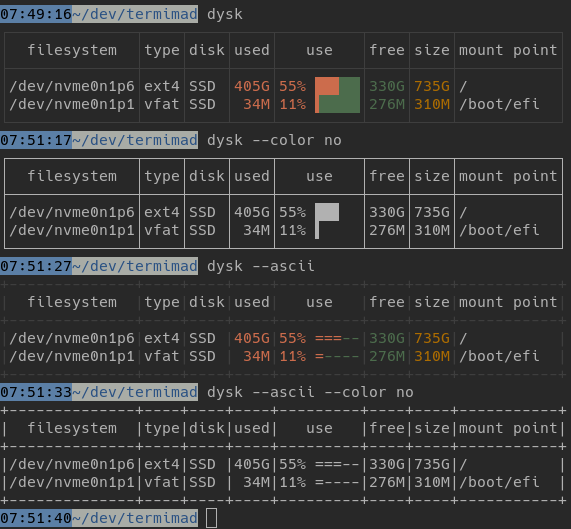

This example demonstrates how to build

* a default skin
* a skin which would only use ASCII characters
* a skin which would not use ANSI escape codes
* a skin combining both properties

Run this example with

    cargo run --example high-compatibility

This adaptation to terminal capabilities is illustrated in [dysk](https://github.com/Canop/dysk):

Most applications should also automatically disable ANSI codes when the output isn't a tty (which happens for example when the output is piped to a file).
